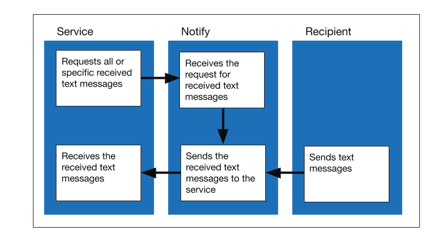

# API architecture

### Architecture for sending a text message

<figure><figcaption></figcaption></figure>

1. The service sends a text message notification to Notify.
2. Notify sends the text message to the provider.
3. The provider delivers the text message to the recipient.
4. The recipient receives the text message and sends a delivery receipt to the provider.
5. The provider sends the delivery receipt to Notify.
6. Notify receives the delivery receipt and sends an API response to the service.
7. The service receives the API response.

### Architecture for sending an email

<figure><figcaption></figcaption></figure>

1. The service sends an email notification to Notify.
2. Notify sends the email to the provider.
3. The provider delivers the email to the recipient.
4. The recipient receives the email and sends a delivery receipt to the provider.
5. The provider sends the delivery receipt to Notify.
6. Notify receives the delivery receipt and sends an API response to the service.
7. The service receives the API response.

### Architecture for sending a letter

<figure><figcaption></figcaption></figure>

1. The service sends a letter notification to Notify.
2. Notify sends the letter to the provider.
3. The provider prints the letter and posts it.
4. The postal service delivers the letter.
5. The recipient receives the letter.

### Architecture for getting the status of a message 

<figure><figcaption></figcaption></figure>

1. The service requests a notification status from Notify.
2. Notify queries the database and retrieves the notification status.
3. Notify sends the API response with the notification status to the service.
4. The service receives the API response.

### Architecture for getting received text messages

<figure><figcaption></figcaption></figure>

1. Recipients send text messages.
2. Notify receives the text messages.
3. The service requests all or specific received text messages from Notify.
4. Notify receives the request for received text messages.
5. Notify sends the received text messages to the service.
6. The service receives the received text messages.
